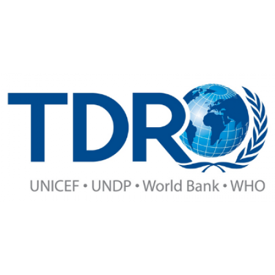

  
# Efficacy of treatment based on ACT therapy in children under five years old with uncomplicated malaria in Africa 

This project has as objective: to determine the efficacy of arthemisinin therapy combination (ACT) to treat children under
five years with hyperparasitemia in Sub-Saharan African conturies usign IPD from IDDO's studies repository. This project 
is leadearship by James Watson and Nick White and is part of my TDR/WHO fellowship project in IDDO. 